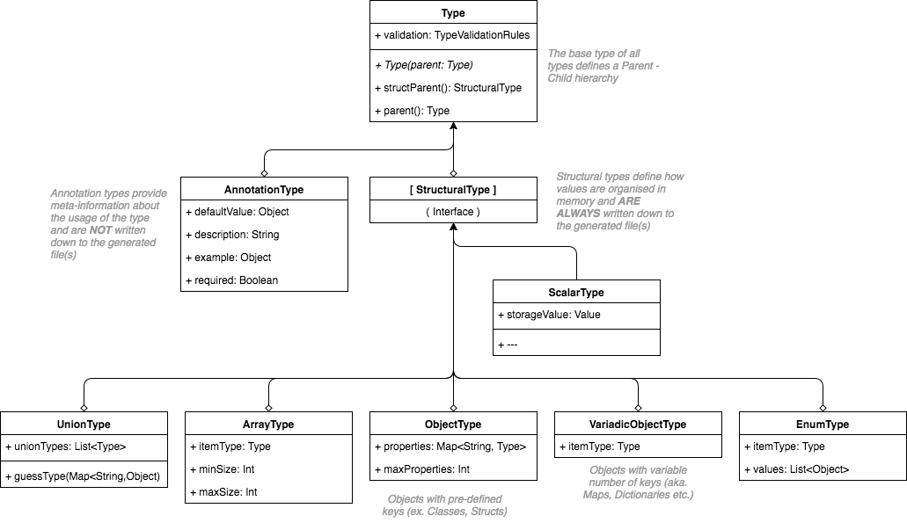

# Internal Types

This document describes the internal type representation that is used in the _DC/OS Type Generator_ project. They can be briefly classified as:

* [Type Classes](#type-classes) : Representing the shape of some properties in memory.
* [Value Classes](#value-classes) : Representing how a value is stored in memory.

## Type Classes

The following diagram defines the `Type` classes used in DTG and their relationship:

The types can be separated in two major 

* The _Structural Types_ that represent how the data are stored in memory and/or stored and/or streamed
* The _Annotative Type_ that provides meta-information regarding a type (ex. default value, description)

The structural types are described in detail in the following sections:

### ScalarType

Defines a scalar type (the leaf type of the type tree). This type has only a `Value` property that defines the shape of the value it carries.

The `Value` type (described later in this document) contains the storage information of this type, such as size requirements and type-specific details.

### ObjectType

Defines an implementation-agnostic object, as a collection of named types (properties) and a parent type in order to define inheritance relations.

### ArrayType

Defines an implementation-agnostic array, as a repetition of a particular type. 

As of current implementation, an Array type CANNOT have children of varying types. However it COULD carry `UnionType`s that could represent more than one underlying types.

### UnionType

Defines an abstract type that can be materialized using different object types, evaluated at run-time.

The selection of the appropriate type is achieved through the use of a particular `discriminatorField` that should be present in all objects in the union. Using the value of that property, one of the child types will be selected.

## Value Classes

The value classes carry the information regarding how the values are stored in memory (while Structures describe how they are _organized in memory_ ). The following types are defined, in close correlation to RAML types:

* `NumberValue( isInteger )` - Describes numerical values
* `StringValue( )` - Describes string values
* `BooleanValue( )` - Describes boolean values
* `DateTimeValue( hasDatePart, hasTimePart, hasTimezone )` - Describes a date/time value, capable of being specialized further to date-only, time-only or timezone-aware
* `AnyValue( )` - Describes a value of "any" kind (ex. `Object`)
* `VoidValue( )` - Describes a value that carries no information

